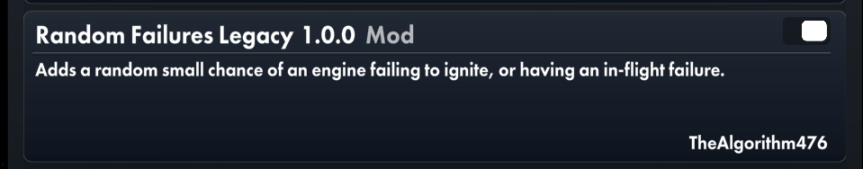
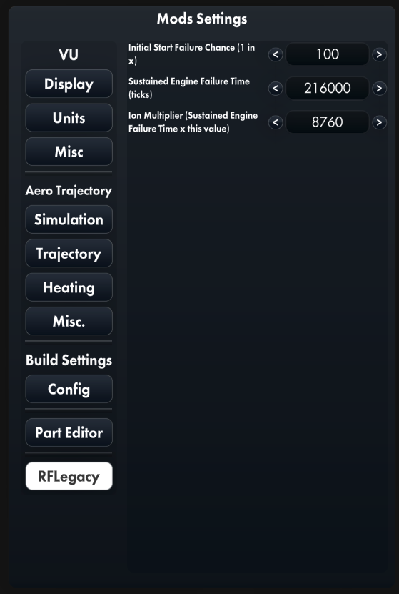
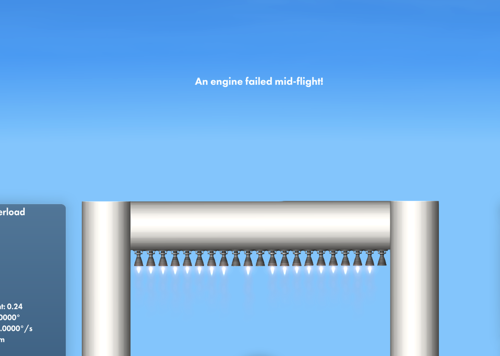

# Random Failures Legacy
*So who said this was a good idea?* -TheAlgorithm476, 2024

## What's this?
This is Random Failures Legacy, a mod for Spaceflight Simulator. RF Legacy adds a random chance your engines will fail to ignite, or fail in-flight. Exciting, right?

## Is it customizable?
Sorta. There are 3 settings available:

| Setting                                                     | Explanation                                                                                                                                                                                                                                            | Default Value   |
|-------------------------------------------------------------|--------------------------------------------------------------------------------------------------------------------------------------------------------------------------------------------------------------------------------------------------------|-----------------|
| Initial Start Failure Chance (1 in x)                       | The chance your engine will fail at first start. If this number were to be 50, 1 out of every 50 engines will fail at startup.                                                                                                                         | 100 (1%)        |
| Sustained Engine Failure Time (ticks)                       | The time (in game ticks) your engine is guaranteed to fail. Your engine may fail sooner, but no later than this number.                                                                                                                                | 216000 (1 hour) |
| Ion Multiplier (Sustained Engine Failure Time x this value) | Ion Engines tend to be way more reliable than normal engines. This number is multiplied by the time to failure for normal engines. For example, if you set the multiplier to 5, Ion Engines will, on average, last 5 times longer than normal engines. | 8760 (1 year)   |

## Small print?
RF Legacy, in its current capacity, is quite limited. Re-joining your world will effectively reset the timer for all engines, and settings applied mid-flight will not be applied to the currently loaded engines.

## Okay you've won me over. How do I install this thing?
Installation is quite straightforward. Download `RandomFailuresLegacy.dll` from the Releases tab, and throw it into SFS's `Mods` folder.

This mod depends on UITools. Recent versions of SFS include it by default, it should be automatically installed when you download the game.

## Photo Gallery
Make sure the mod is visible in the Mod List, like this:

RF Legacy Settings:

A few engines having failed:

